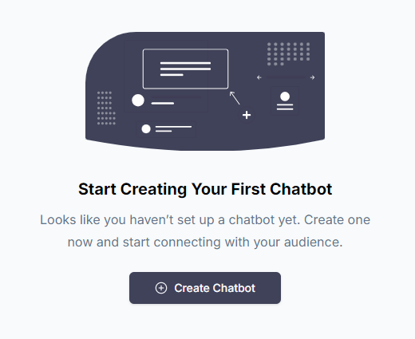
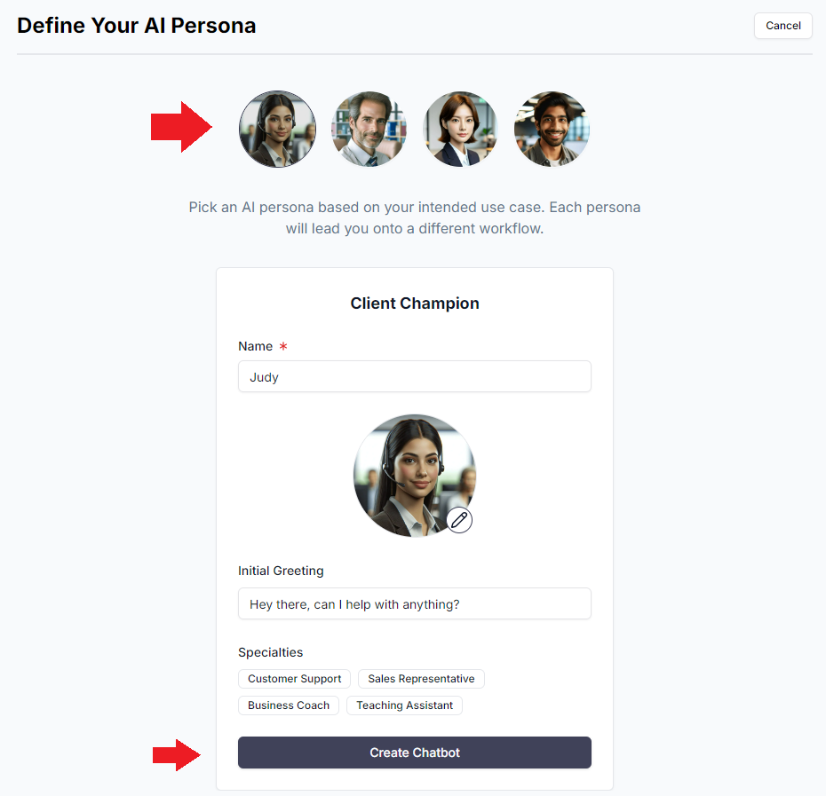
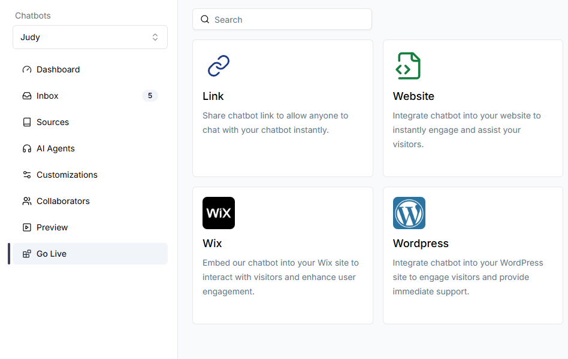
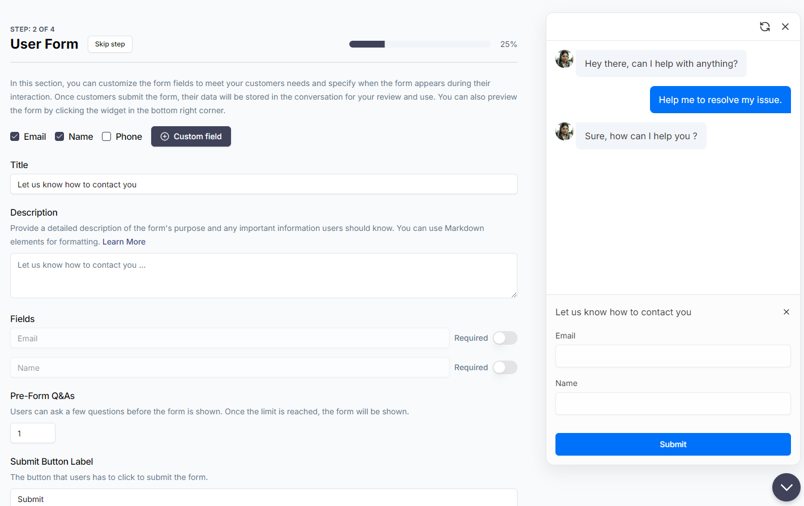
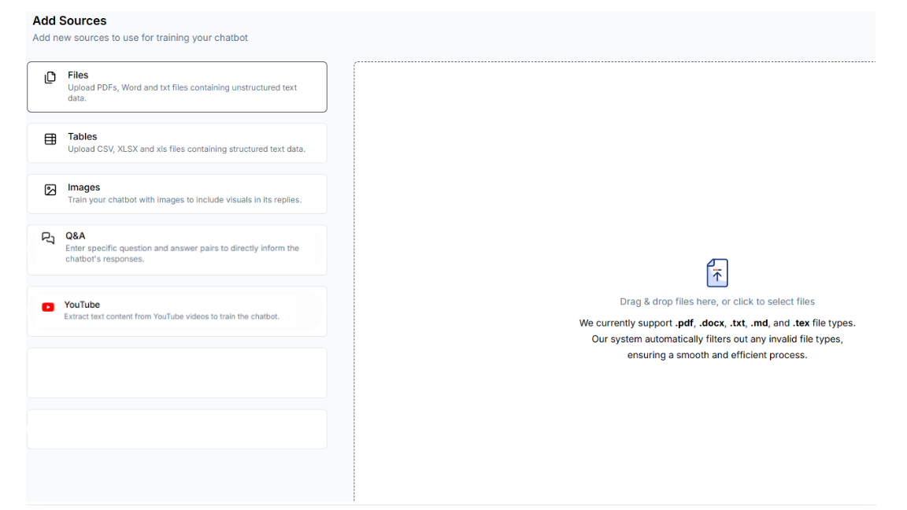
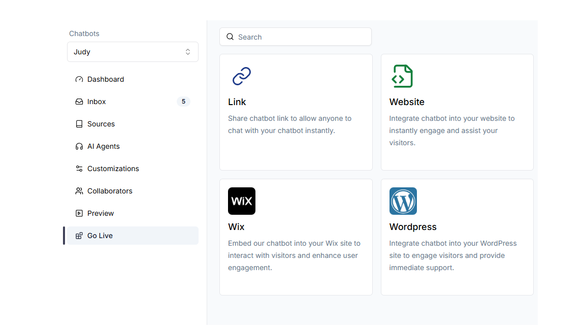

To get started, first log in to your account. If this is your first time using Chatwize, you will be asked to complete some initial onboarding steps. Afterwards, you will be presented with the ability to build an AI chatbot from one of our templates:

## Initial Setup

Click on “Create Chatbot”. Then, you will be given a few personas to characterize your AI Agent based on your use case.

These personas have been predefined with a number of use-case-specific customizations, so they work out of the box, for the most part. Each persona has a different setup flow, but all of them should be very easy to follow.

Let’s take Client Champion for example. After you select the persona, you can pick your AI Agent’s specialty. In our case, we will go with Customer Support. Next, we tell the system which company the AI Agent represents, as well as the human support team’s contact in case issues need to be escalated.

Depending on how strictly you want the AI Agent to stick to its training data (you will get the chance to provide this later), you can pick one of the options at the bottom. Let’s pick “Rely only on given data” to be conservative for now.

Click “Continue”. Then, since this is a client-facing chatbot, you will be asked to configure a data collection form from the user.

Here, you can define custom form fields, make certain fields mandatory, make the whole form mandatory, make the form show up only after certain number of Q&As, and much more. When you user submits the form, the data is collected and assocated with the conversation session. You can then export it as a CSV, or have it sent to you automatically by email or to a CRM via webhook.

If you don’t want a form, simply hit “Skip step” on the top left next to the title.

Next, let’s edit the appearance of the chat widget. In order to make it thematically consistent with the rest of your website, we have provided you with a large range of customization options, including font size, color, avatars, and more. We kept things simple for the template guide, so if you prefer, you can revisit more advanced settings under **Customizations** tab on the left navigation bar after your chatbot’s initial setup is complete.

## Uploading Training Data

Finally, you are ready to train your AI Agent with your own data\!

You can upload relevant training data (PDFs, Word, txt) or question and answer after making the chatbot. If you have Excel tables, CSVs, images, or YouTube videos, you can upload them later in the **Sources** tab on the left navigation bar.

Click “Add to Sources”.

Wait for the training to complete. Then, click “Try it out”. Chatwize will open a new tab where you can start testing the preliminary chatbot.

In general, the chatbot should be well-configured enough as-is for most common use cases. However, if you would like to fine tune the chatbot behavior further, update the training data or appearance, or even add additional AI Agents to expand the chatbot’s capabilities, you can do it by opening the chatbot and tweaking various options on the left navigation bar.

Close the chatbot testing tab. You will return to Chatwize’s main interface. Go through the onboarding guide to learn more about your options.

When you are ready to deploy your chatbot, head to the **Go Live** tab.

If you want to share the chatbot as a standalone page, simply click **Link**. You should see a share link automatically generated for you.

If you want to embed the chatbot onto a web page, click **Website**. Detailed instructions will be displayed on the new right sidebar.

To add more chatbots, simply go to the left sidebar and click the dropdown menu. You will be taken to a dedicated page to manage all of your chatbots.

Please note that depending on your current subscription plan, there is a limit to the number of chatbots you can create.

## Interrupted Workflows

If you need to exit the browser at any point and return to your chatbot creation process later, you will see a screen similar to the image below. You can easily resume your chatbot creation process by clicking on the Work-In-Progress (WIP) chatbot card.

