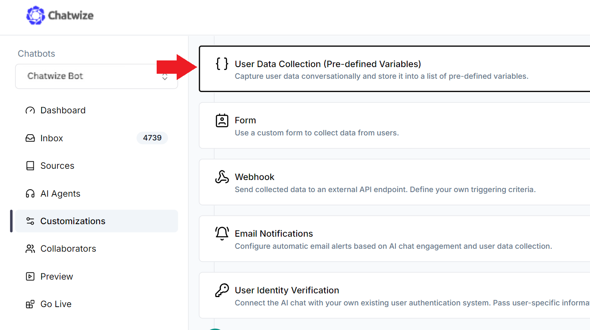

There are two ways to collect data from users when they engage with your AI Chat.

1. Through a form
2. Conversationally

There are pros and cons for each approach. Forms are easier to set up and are programmatic, but collecting information conversationally is more natural and engaging despite the added complexity. You can send any collected data via webhook to a CRM as soon as your user submits it.

---

### Collecting Data Through a Form

To add a form to your AI Chat, go to the **Customizations** tab on the left navigation menu, then scroll down until you see the “Form” section:


You can select one of the default fields you’d like to include in the form. Alternatively, you can create custom fields.


For custom fields, you can change the field types (text, dropdown, checkbox). You can also make certain fields mandatory. If at least one field is mandatory, you will also gain the option to make the entire form mandatory before the user can proceed with chatting. Making the form mandatory will cause the “x” button on the top right of the form to disappear, thereby preventing users from closing the form before completing it.


---

### Collecting Data Conversationally

If you want to maintain a natural conversational flow and collect data from users directly, you will have to configure your AI Agent(s) prompt and set up variables to store the collected information.

---

### Editing the Prompt

The behavior of your AI Chat is governed by your AI Agent(s)‘s prompt. To review and edit the prompt, go to the **AI Agents** tab on the left navigation menu, then click on the Agent you’d like to edit.

If you created your AI Chat using a template, then you may be using a default prompt we generated for you. If this is the first time you are configuring an AI Agent prompt, we recommend you to read our **Prompt Engineering guide** for best practices.


Configure your prompt to include detailed instructions for collecting user data. Make sure you cover when, what, and how. For example, here is a snippet that can serve as a guide:

---

### Instructions

```plaintext
- When engaging with the user for the first time, politely ask for their first name.
- Once the user provides their first name, proceed with the following steps to collect their contact information.
- Ask for the user's mobile telephone number after collecting their first name.
- After the mobile telephone number is collected, ask for their e-mail address.
- If the user is not comfortable providing any particular piece of information, do not force them. Respect their decision.

Go to Customizations tab on right navigation bar, then scroll down until you see “User Data Collection”. Click to expand it.



Inside, you can create variables to store information that is collected from the user during the conversation. You can set up multiple variables, each corresponding to a single piece of information. When setting up a variable, please provide the variable name, description, and example values. Try to be as detailed and explicit as possible.


*The more examples you provide, the better it is for the AI to understand the format you’re looking for.*
